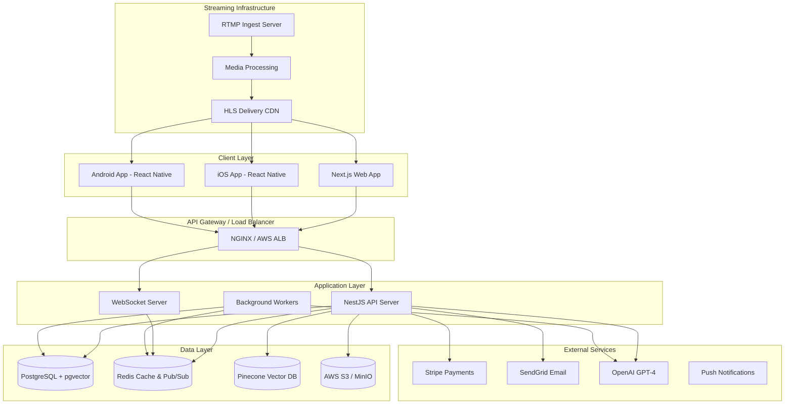
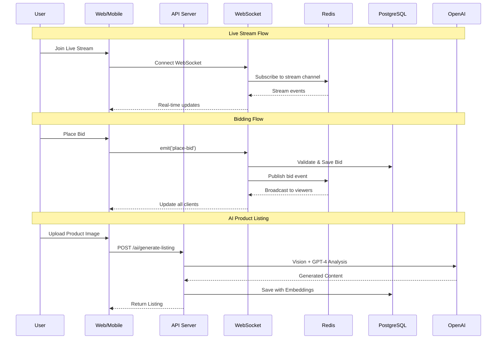
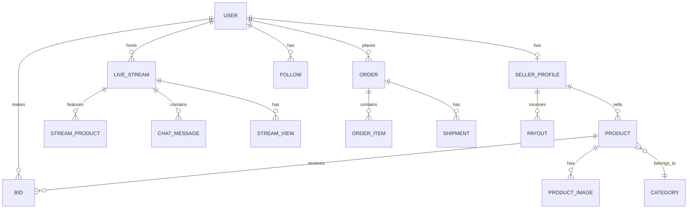

# LiveShop Architecture Documentation

## System Architecture Diagram

## Data Flow Diagram

## Technology Stack

### Backend
| Component | Technology | Purpose |
|-----------|------------|---------|
| Runtime | Node.js 20 | Server runtime |
| Framework | NestJS 10 | API framework |
| Database | PostgreSQL 16 | Primary data store |
| Cache | Redis 7 | Caching, Pub/Sub, Sessions |
| ORM | Prisma 5 | Database access |
| Auth | JWT + Argon2 | Authentication |
| Docs | Swagger/OpenAPI | API documentation |

### Frontend (Web)
| Component | Technology | Purpose |
|-----------|------------|---------|
| Framework | Next.js 14 | React framework |
| Styling | Tailwind CSS | Utility CSS |
| State | Zustand + React Query | State management |
| Forms | React Hook Form + Zod | Form handling |
| Real-time | Socket.IO Client | WebSocket |

### Mobile (iOS + Android)
| Component | Technology | Purpose |
|-----------|------------|---------|
| Framework | React Native / Expo | Cross-platform |
| Navigation | Expo Router | File-based routing |
| Storage | SecureStore | Secure token storage |
| Video | Expo AV | HLS playback |

### AI/ML Layer
| Component | Technology | Purpose |
|-----------|------------|---------|
| LLM | OpenAI GPT-4 | Text generation |
| Vision | GPT-4 Vision | Image analysis |
| Embeddings | text-embedding-3-small | Semantic search |
| Vector DB | Pinecone | Vector storage |
| Moderation | OpenAI Moderation | Content safety |

### Infrastructure
| Component | Technology | Purpose |
|-----------|------------|---------|
| Containers | Docker | Containerization |
| Orchestration | Docker Compose / K8s | Container orchestration |
| CI/CD | GitHub Actions | Automation |
| CDN | CloudFront | Static assets |
| Storage | AWS S3 | File storage |
| Streaming | NGINX-RTMP | Live video |

## Database Schema Overview

## Security Architecture

### Authentication Flow
1. User submits credentials
2. Server validates with Argon2
3. JWT access token (15min) + refresh token (7d) issued
4. Access token stored in memory/cookie
5. Refresh token stored in httpOnly cookie
6. Token rotation on refresh

### Security Measures
- Rate limiting (Throttler)
- CORS configuration
- Helmet.js headers
- Input validation (class-validator)
- SQL injection prevention (Prisma)
- XSS protection
- CSRF tokens for forms
- Role-based access control

## Scalability Considerations

### Horizontal Scaling
- Stateless API servers
- Redis for session/cache
- S3 for file storage
- CDN for static assets

### Performance Optimizations
- Database connection pooling
- Redis caching layer
- Query optimization with indexes
- Image compression/CDN
- Lazy loading on frontend
- WebSocket connection pooling

## Monitoring & Observability

### Metrics
- Request latency
- Error rates
- Database performance
- Cache hit rates
- WebSocket connections

### Logging
- Structured JSON logs
- Request/response logging
- Error stack traces
- Audit logs for sensitive operations
